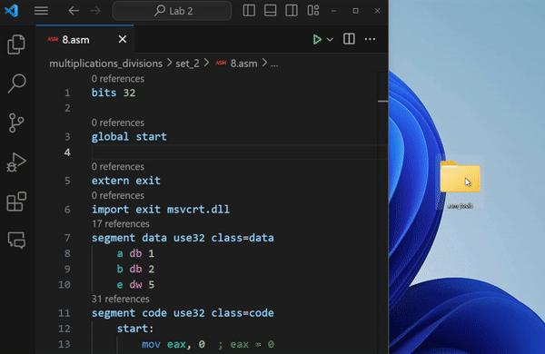

# Assembly for OllyDbg

This extension adds support for assembly language to OllyDbg.

## Requirements

Asm Tools for OllyDbg is required to be downloaded. It can be downloaded from [here](https://www.cs.ubbcluj.ro/~vancea/asc/files/ASM_tools.zip)

You need to set the path of the Asm Tools in the settings of the extension.

## Features

* Run assmbly code file of current active Text Editor
* Debugging assembly code in OllyDbg.
* Build assembly code using nasm.
* Option to hide the executable file while debugging.

## Usage

* Open a assembly code file in the editor.
* Press the play button in the toolbar or press `Ctrl+Alt+N` to debug the code in OllyDbg.
* Press the stop button in the toolbar or press `Ctrl+Alt+M` to stop the debugger and the executable files.

